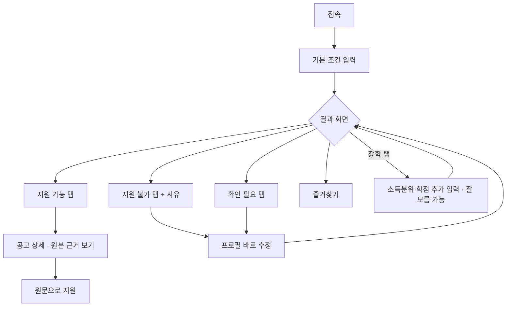
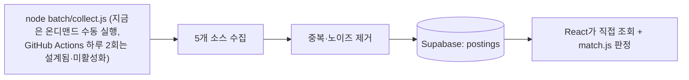

# 대외활동 큐레이션

기획은 [docs/기획.md](docs/기획.md), 데이터 전략은 [docs/데이터-수집.md](docs/데이터-수집.md), 설계는 [docs/schema.md](docs/schema.md),
개발 백로그는 [docs/checklist.md](docs/checklist.md), 이번 주 계획은 [docs/주간계획.md](docs/주간계획.md)에.

대학생 대외활동, 공모전, 장학, 봉사 정보는 링커리어, 콘테스트코리아, 온통청년, 장학재단, 1365 등
여러 곳에 흩어져 있다. 각 사이트는 모든 공고를 다 보여줄 뿐이라, 내가 실제로 지원할 수 있는 건
직접 골라내야 한다. 이 프로젝트는 거기서 출발한다.

## 무엇을 만드나

- **흩어진 공고를 최대한 다 모은다(총망라). 이게 1순위다.** 소스를 계속 늘리고, 각 소스에서 빠짐없이 긁는다.
- 다 모은 것 중 내 조건(학년·전공·지역·소득 등)에 맞는 걸 정확히 골라 위로 올린다. 안 되는 건 이유까지
  보여준다. 이 개인 자격 매칭이 차별점이다.
- 커버하는 소스는 분명히 밝힌다. 인터넷 전체를 다 훑겠다는 약속은 안 하지만, 커버 범위 안에서는 안 놓친다.

## 로드맵

- 1주차: 기획·설계·디자인·개발 환경 (완료)
- 2주차: React 화면 -> Supabase 직접 조회로 실데이터 한 사이클 (완료)
- 3주차: 총망라 (콘테스트코리아·링커리어·위비티·부산청년플랫폼·온통청년 다섯 소스 크롤러, 중복·노이즈 제거,
  놓침 방지 자동정지, 상세화면 즉시 재매칭 완료. LLM 파싱은 코드 작성 완료, 실제 호출은 키 발급 후 검증 예정)
- 4주차: 정확도 측정·상세 근거·배포 (진행 예정)

세부 진행 상황은 [docs/checklist.md](docs/checklist.md)에 항목별로 정리돼 있다.

## 구조

Express 서버는 없다. React가 Supabase를 직접 조회(supabase-js)하고, 매칭도 화면 쪽 자바스크립트(match.js)에서
계산한다. 조건 입력 -> 결과(가능/확인 필요/거의 가능/불가)까지 화면 흐름은 이렇다.



데이터는 무거운 수집·정제를 사용자 접속과 분리해서 미리 끝내둔다. 지금은 `node batch/collect.js`를
온디맨드(수동)로 돌리고 있고, GitHub Actions로 하루 2회 자동 실행하는 워크플로(`.github/workflows/collect.yml`)는
설계·작성까지 끝났지만 시크릿 미등록으로 아직 활성화 전이다(#23).



## 실행

```bash
npm install
npm run dev
```
