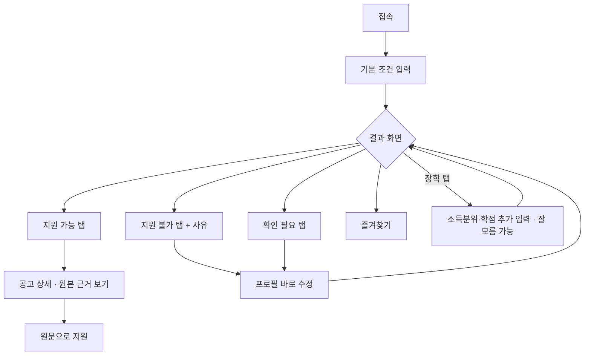
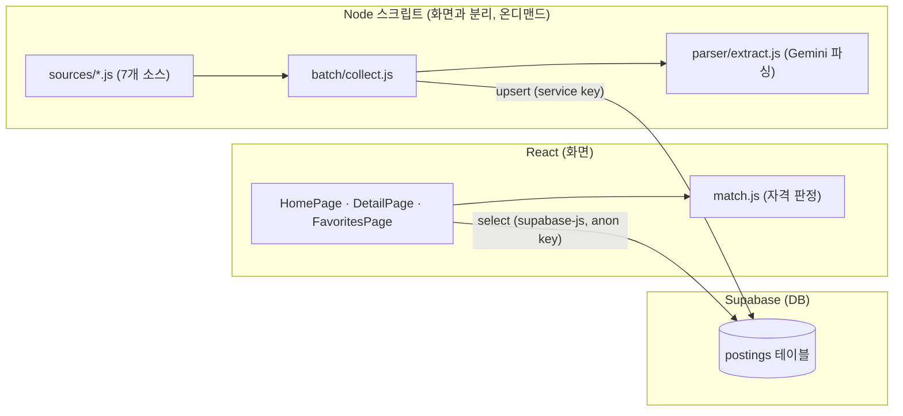

# 대외활동 큐레이션

내 조건에 맞는 대외활동·공모전·장학만 골라주는 서비스.

기획은 [docs/기획.md](docs/기획.md), 데이터 전략은 [docs/데이터-수집.md](docs/데이터-수집.md), 설계는 [docs/schema.md](docs/schema.md),
개발 백로그는 [docs/checklist.md](docs/checklist.md), 이번 주 계획은 [docs/주간계획.md](docs/주간계획.md)에.

대학생 대외활동·공모전·장학 정보는 링커리어, 콘테스트코리아, 위비티, 온통청년, 부산·서울 청년포털,
한국장학재단 등 여러 곳에 흩어져 있다. 각 사이트는 모든 공고를 다 보여줄 뿐이라, 내가 실제로 지원할 수 있는 건
자격요건을 하나하나 읽어 직접 골라내야 한다. 이 프로젝트는 거기서 출발한다.

## 무엇을 만드나

- **흩어진 공고를 최대한 다 모은다(총망라). 이게 1순위다.** 소스를 계속 늘리고, 각 소스에서 빠짐없이 긁는다.
- 다 모은 것 중 내 조건(학년·전공·지역·소득 등)에 맞는 걸 정확히 골라 위로 올린다. 안 되는 건 이유까지
  보여준다. 이 개인 자격 매칭이 차별점이다.
- 커버하는 소스는 분명히 밝힌다. 인터넷 전체를 다 훑겠다는 약속은 안 하지만, 커버 범위 안에서는 안 놓친다.

## 소스 (7곳, 실데이터 6,092건)

총망라가 1순위라 소스를 계속 늘린다. 지금 붙인 7곳과 수집 방식은 이렇다(2026-07-24 기준).

| 소스 | 성격 | 방식 | 수집 |
|---|---|---|--:|
| 온통청년 | 전국 청년정책·지원금 | 공공 API | 2,291 |
| 한국장학재단 | 장학 | API(월 스냅샷) | 1,849 |
| 링커리어 | 대외활동·공모전 | 내부 API | 990 |
| 콘테스트코리아 | 공모전 | 크롤링 | 789 |
| 서울 청년몽땅정보통 | 서울 지자체 모집공지 | 크롤링 | 98 |
| 부산청년플랫폼 | 부산 지자체 모집공지 | 크롤링 | 53 |
| 위비티 | 공모전·대외활동 | 크롤링 | 22 |

API가 있으면 API를, 없으면 정적 HTML 크롤링이나 내부 API를 쓴다. 여러 소스에 겹쳐 실린 같은 공고는
제목 정규화 + URL로 중복 제거한다. 마감이 연속으로 지난 공고가 이어지면 자동으로 멈춰 옛 페이지를 안 긁는다.
1365 자원봉사는 맞는 공개 API가 없어 붙이지 않았다.

## 매칭 (차별점)

다 모은 공고를 내 조건과 대조해 네 갈래로 나눈다. 자격요건을 기계가 못 읽었으면 공고 전체가 아니라 그 조건만
"확인 필요"로 남겨(부분 판정), 총망라를 해치지 않으면서 정확도를 높인다.

- **지원 가능** — 필수 조건을 모두 충족
- **거의 가능** — 학년 1급간 차이처럼 조건 하나 차이. 뭘 바꾸면 되는지 보여준다.
- **확인 필요** — 자격요건을 못 읽었거나 애매함
- **지원 불가** — 안 맞는 조건과 이유를 표시. 안 버리고 사유까지 남긴다.

상세 화면에서 막힌 조건을 바로 고치면 즉시 다시 판정한다. 조건 입력부터 결과까지 화면 흐름은 이렇다.



## 아키텍처 (화면·수집기·DB, 데이터가 흐르는 방향)

이 서비스엔 흔한 "화면 -> 서버 -> DB" 구조가 아니라, **화면과 완전히 분리된 두 갈래 길**이 있다. 화면(React)은
Supabase에서 읽기만 하고, 쓰기(수집)는 화면과 무관하게 별도 Node 스크립트가 온디맨드로 돈다. 그래서 서버 박스가
없다 - 사용자 액션이 DB에 쓰는 경로 자체가 아예 없다는 게 이 구조를 그려보고 나서 알게 된 점이다.



지금은 `node batch/collect.js`를 손으로 실행하고 있고, GitHub Actions로 자동 실행하는 워크플로
(`.github/workflows/collect.yml`)는 설계·작성까지 끝냈지만 시크릿 미등록으로 아직 활성화 전이다(#23).

## 테스트

핵심 순수 함수는 테스트를 먼저 쓰고 구현했다(TDD). 서버는 의존성 없는 `node:test`, 프론트는 vitest를 쓴다.

- 서버: `cd server && npm test` (지역 판별 regionLookup, 위비티 파서 등)
- 프론트: `npm test` (매칭 match, 마감일 deadline, 카드 렌더)

## 기술 스택

- 프론트: React (Vite) + react-router-dom. Supabase를 supabase-js로 직접 조회, 매칭은 화면 쪽 match.js.
- 데이터: Supabase (Postgres, 자격요건은 JSONB).
- 수집: Node 스크립트 (cheerio 크롤링 + 공공·내부 API).
- 파싱: Gemini 3.5 Flash-Lite(무료 등급)로 크롤링한 자유 문장 자격요건을 구조화. API가 구조로 주는 값은 규칙으로 매핑해 호출을 아낀다.

## 로드맵

- 1주차: 기획·설계·디자인·개발 환경 (완료)
- 2주차: React 화면 -> Supabase 직접 조회로 실데이터 한 사이클 (완료)
- 3주차: 총망라 (7개 소스 크롤러·API, 중복·노이즈 제거, 놓침 방지 자동정지, 상세화면 즉시 재매칭, TDD 도입 완료.
  LLM 파싱은 Gemini로 코드 작성 완료, 실제 호출은 키 발급 후 검증 예정)
- 4주차: 정확도 측정(gold 라벨)·상세 근거·배포 (진행 예정)

세부 진행 상황은 [docs/checklist.md](docs/checklist.md)에 항목별로 정리돼 있다.

## 실행

```bash
npm install
npm run dev
```

## 발표자료

프로젝트 소개·데모 발표자료: https://jaeho9338-code.github.io/curation-deck/
