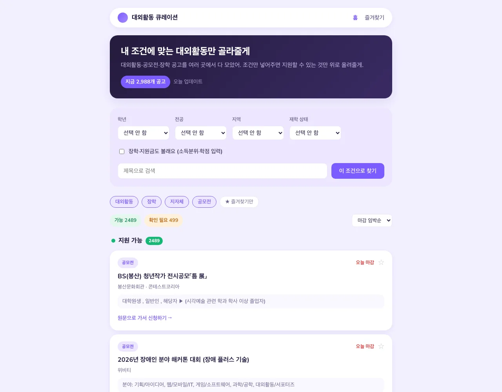
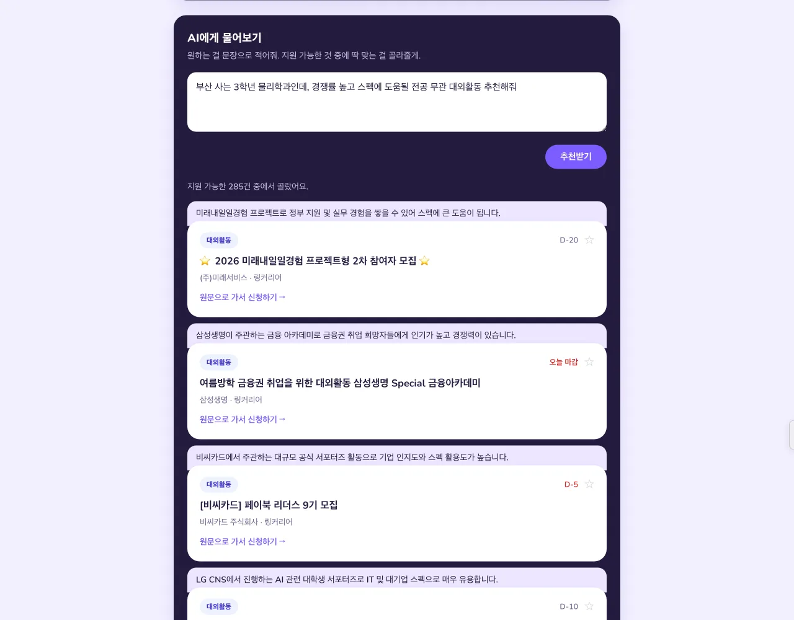
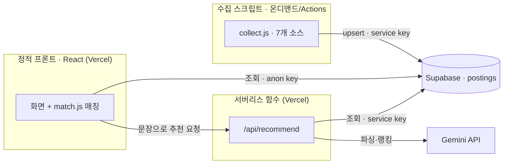
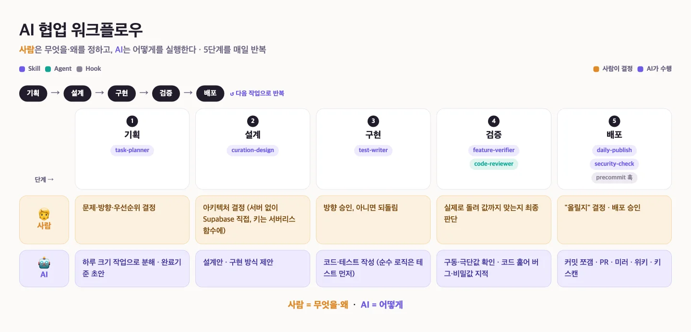

# 대외활동 큐레이션

> 흩어진 대외활동·공모전·장학을 다 모아, **내 조건에 맞는 것만** 골라주고, **문장으로 물어보면 AI가 추천**하는 서비스.

**🔗 라이브 데모 · [activity-curation.vercel.app](https://activity-curation.vercel.app)**  ·  🎬 [데모 영상](https://drive.google.com/file/d/1atgNhEZ5tp2yyPSmaPisHUA-wvPANZBR/view?usp=sharing)  ·  🖥️ [발표자료](https://jaeho9338-code.github.io/curation-deck/)



대학생 대외활동·공모전·장학 정보는 링커리어·콘테스트코리아·위비티·온통청년·지자체 포털·장학재단 등 여러 곳에 흩어져 있다. 각 사이트는 모든 공고를 보여줄 뿐이라, 내가 실제로 지원할 수 있는 건 자격요건을 하나하나 읽어 직접 골라내야 한다. 그러다 놓치거나, 자격 미달인데 지원해 시간을 버린다. 이 프로젝트는 거기서 출발한다.

## 핵심 기능

**1. 총망라 수집** — 7개 소스에서 매 수집 6,000건 이상을 훑어, 중복·마감 지난 걸 걸러 **2,800여 건**을 최신으로 유지한다. 커버하는 소스는 분명히 밝히고, 그 범위 안에서는 안 놓친다.

**2. 정확한 자격 매칭 (차별점)** — 내 조건(학년·전공·지역·소득 등)과 대조해 네 갈래로 나눈다.

- **지원 가능** — 필수 조건을 모두 충족
- **거의 가능** — 학년 1급간 차이처럼 조건 하나 차이. 뭘 바꾸면 되는지 보여준다
- **확인 필요** — 자격요건을 못 읽었거나 애매함 (공고 전체가 아니라 그 조건만 부분 판정)
- **지원 불가** — 안 맞는 조건과 **이유까지** 표시. 안 버리고 사유를 남긴다

상세 화면에서 막힌 조건을 바로 고치면 즉시 다시 판정한다.

**3. AI 자연어 추천** — "부산 3학년인데 경쟁률 높고 스펙에 도움될 전공 무관 대외활동 찾아줘"처럼 문장으로 물어보면, 지원 가능한 것 중에서 골라 이유까지 답한다.

> 규칙과 LLM을 강점대로 나눠 쓴다. **Gemini가 문장에서 조건·의도를 뽑고 → 규칙(match.js)이 지원 가능한 것만 추리고 → 다시 Gemini가 의도에 맞게 순위·이유를 단다.** 목록에 없는 건 지어내지 않는다. 규칙은 사람 말투를 못 읽고 LLM은 자격 판정을 정확히 못 하니, 각자 잘하는 일만 맡겼다.



## 아키텍처

흔한 "화면 → 서버 → DB"가 아니라, 화면과 분리된 구조다. 화면(React)은 Supabase를 **직접 조회**하고 매칭도 화면 쪽 `match.js`에서 한다(Express 조회 서버 없음). 수집은 화면과 무관하게 별도 Node 스크립트가 온디맨드로 돈다. AI 추천만은 비밀 키를 숨기려고 **Vercel 서버리스 함수**에서 Gemini를 부른다.


```mermaid
flowchart LR
  subgraph FE["정적 프론트 · React (Vercel)"]
    Pages["화면 + match.js 매칭"]
  end
  subgraph Fn["서버리스 함수 (Vercel)"]
    Rec["/api/recommend"]
  end
  subgraph Col["수집 스크립트 · 온디맨드/Actions"]
    Collect["collect.js · 7개 소스"]
  end
  DB[("Supabase · postings")]
  Gemini["Gemini API"]
  Pages -- "조회 · anon key" --> DB
  Pages -- "문장으로 추천 요청" --> Rec
  Rec -- "조회 · service key" --> DB
  Rec -- "파싱·랭킹" --> Gemini
  Collect -- "upsert · service key" --> DB
```

정적 프론트 + 서버리스 함수 하나로 Vercel에 배포. **비밀 키(Gemini·Supabase service)는 서버 함수 env에만 두고 브라우저 번들엔 안 나간다.** 프론트는 공개해도 안전한 anon 키로만 조회한다. 배포 방법은 [docs/배포.md](docs/배포.md).

## 소스 (7곳)

| 소스 | 성격 | 방식 |
|---|---|---|
| 온통청년 | 전국 청년정책·지원금·장학 | 공공 API |
| 한국장학재단 | 장학 | API (월 스냅샷) |
| 링커리어 | 대외활동·공모전 | 내부 API |
| 콘테스트코리아 | 공모전 | 크롤링 |
| 서울 청년몽땅정보통 | 서울 지자체 모집공지 | 크롤링 |
| 부산청년플랫폼 | 부산 지자체 모집공지 | 크롤링 |
| 위비티 | 공모전·대외활동 | 크롤링 |

API가 있으면 API를, 없으면 정적 HTML 크롤링이나 내부 API를 쓴다. 여러 소스에 겹친 같은 공고는 제목 정규화 + URL로 중복 제거하고, 마감이 연속으로 지난 공고가 이어지면 자동으로 멈춰 옛 페이지를 안 긁는다. 수집 소스는 하나씩 끼우는 구조라 소스가 늘어도 나머지는 안 건드린다. GitHub Actions로 하루 2번 자동 수집하는 워크플로(`.github/workflows/collect.yml`)도 작성해뒀다.

## AI와 협업한 방식

비전공자가 AI 에이전트(Claude Code)와 4주간 만들면서 실제로 굳어진 작업 방식이다. 기획 → 설계 → 구현 → 검증 → 배포 다섯 단계를 매일 반복했고, **사람은 무엇을·왜를 정하고 AI는 어떻게를 실행**했다. 스킬 6개와 코드 검증 에이전트를 직접 만들어 붙였고, 검증을 두 겹(실제 구동 + 코드 리뷰)으로 둔 게 진짜 버그를 걸렀다.

전체 흐름과 단계별 입력·확인기준·결과물은 [docs/워크플로우.md](docs/워크플로우.md)에, 한눈에 보는 시각화는 [docs/워크플로우-시각화.html](docs/워크플로우-시각화.html)에.



## 기술 스택

- **프론트**: React (Vite) + react-router-dom. Supabase를 supabase-js로 직접 조회, 매칭은 화면 쪽 match.js.
- **데이터**: Supabase (Postgres, 자격요건은 JSONB).
- **수집**: Node 스크립트 (cheerio 크롤링 + 공공·내부 API).
- **AI**: Gemini (자연어 추천 — 문장 파싱 + 의도 랭킹).
- **배포**: Vercel (정적 프론트 + `/api/recommend` 서버리스 함수).

## 테스트

핵심 순수 함수는 테스트를 먼저 쓰고 구현했다(TDD). 서버는 의존성 없는 `node:test`, 프론트는 vitest.

- 서버: `cd server && npm test` (지역 판별 regionLookup, 위비티 파서 등)
- 프론트: `npm test` (매칭 match, 마감일 deadline, 카드 렌더 등)

## 실행

```bash
# 프론트 (Supabase 직접 조회)
npm install
npm run dev

# AI 추천 로컬 API 서버 (별도 터미널, 키는 server/.env)
cd server && npm run api

# 수집 한 번 돌리기
cd server && node batch/collect.js
```

환경변수는 `.env.example` 참고. 비밀 키는 `.env`로만 관리하고 절대 커밋하지 않는다.
