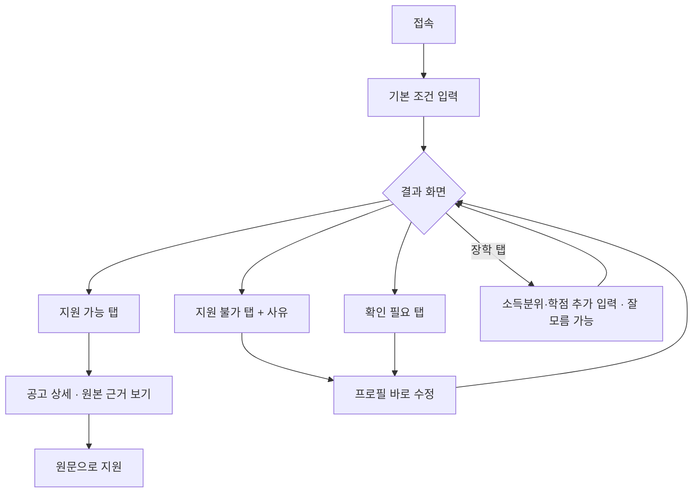
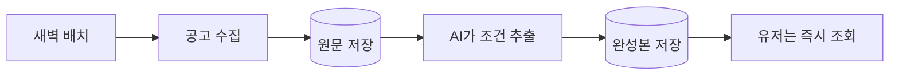

# 대외활동 큐레이션 - 기획·구현 설계서 (폐기됨)

> 이 문서는 1주차 초안이라 폐기한다. 최신 기획은 docs/기획.md, 데이터 전략은 docs/데이터-수집.md,
> 설계는 docs/schema.md, 이번 주 계획은 docs/주간계획.md를 본다. 아래는 초안 기록으로만 남긴다.

한 줄 방향: 흩어진 공고를 모으는 게 아니라, 내 자격에 맞는 것만 정확히 골라준다.
이 문서는 그걸 어떻게 정확하게, 그리고 실제 데이터에서도 안 깨지게 만들지를 다룬다.
본문은 누구나 읽고 판단할 수 있게 말로 풀어 썼고, 코드·표 같은 기술 상세는 맨 뒤 부록에 뺐다.
작업 분해는 [checklist.md](checklist.md)에.

---

## 1. 문제 정의

대학생이 대외활동·공모전·장학에 지원하려 할 때, 공고가 여러 사이트에 흩어져 있고 각 사이트는
모든 공고를 다 보여주기만 해서, 자기 자격에 맞는 걸 일일이 읽어 걸러야 하고 그 과정에서 놓치거나
지원했다가 자격 미달로 시간을 버린다.

## 2. 사용자 시나리오

1. 접속해서 기본 조건(학년·전공·지역 등)을 입력한다.
2. 내 조건에 맞는 공고 목록을 본다.
3. 안 맞는 공고는 왜 안 되는지 사유를 확인한다.
4. 장학 탭에 들어가면 소득분위·학점 같은 걸 추가로 묻는다. 모르면 잘 모름을 고른다.
5. 막힌 공고의 사유를 보고 그 자리에서 프로필을 고쳐 다시 확인한다.
6. 관심 공고의 원문으로 가서 지원한다.

## 3. 핵심 기능 2개 (MVP)

1. 내 조건으로 지원 가능한 공고만 골라 보여주기. 이게 없으면 서비스가 성립하지 않고, 문제를 정면으로 해결한다.
2. 지원 불가 공고를 사유와 함께 보여주기. 숨기지 않고 왜 안 되는지 알려줘 신뢰를 만들고, 기존 서비스가 안 하는 차별점.

수집·AI 파싱은 이 둘을 떠받치는 뒷단이며 아래에서 다룬다.

## 4. 화면 흐름

## 5. 정확도의 핵심 - 조건을 충분히, 똑똑하게 받는다

학년·전공·지역 세 개만 물으면, 나한테 안 맞는 공고가 너무 많이 딸려 나온다. 실제 공고는 훨씬 많은
조건을 걸기 때문이다. 그래서 조건을 넉넉히 둔다. 트랙별로 보는 조건은 이렇다.

공통(둘 다)
- 학년·학기, 재학 상태(재학·휴학·졸업예정 등), 전공 계열, 소속 대학과 그 소재 지역, 거주 지역, 국적

대외활동에서 더 보는 것
- 활동 형태(팀·개인, 온라인·오프라인), 요구 어학 성적, 특정 전공·경험 요구

장학·지원금에서 더 보는 것
- 소득분위, 직전 학기 학점, 이수 학점, 특수 대상(국가보훈·장애·다자녀·한부모·기초수급 등), 다른 장학과 중복 수혜 가능 여부

조건이 많으면 입력이 귀찮고, 소득분위·학점처럼 본인도 모르는 항목이 있다. 그래서 이렇게 푼다.
- 한 번에 다 묻지 않는다. 그 트랙·카테고리에 들어갈 때 필요한 것만 그때 묻는다.
- 모르면 잘 모름을 고를 수 있고, 그 조건은 지원 불가로 빼지 않고 확인 필요로 둔다.

즉 조건을 많이 둬서 정확도는 올리되, 사용자가 다 채우지 않아도 되고 모른다고 잘못 걸러지지도 않는다.
이게 정확도와 편의를 동시에 잡는 방법이다.

## 6. 실제 데이터에서도 안 깨지게 (목데이터 vs 실제 API)

우리가 만든 깔끔한 샘플과 실제 공고는 다르다. 현실은 이렇다.
- 자격요건이 정돈된 값이 아니라 자유 문장, 표, 이미지, 첨부 파일에 흩어져 있다.
- "수도권 우대"처럼 필수인지 우대인지 애매한 표현이 많다.
- 어떤 조건은 아예 안 적혀 있고(무관), 가끔 서로 모순된다.
- 사이트 구조가 바뀌면 수집 자체가 깨진다.

그래서 로직을 이렇게 탄탄하게 잡는다.
- 딱 떨어지는 값만 조건으로 확정하고, 애매하거나 못 읽은 건 억지로 채우지 않는다. 그런 공고는 지원 불가로 숨기지 않고 확인 필요로 드러낸다. 놓쳐서 안 보여주는 게 가장 나쁜 실수다.
- AI가 각 조건을 원문 어디서 읽었는지 근거 문장을 같이 저장한다. 근거가 없으면 신뢰도를 낮춰 확인 필요로 보낸다.
- 우대 조건은 매칭에 쓰지 않는다. 필수 조건만 판정하고, 우대 문구는 원문에 있으면 표시만 한다. 우대까지 구조화하면 복잡도만 커지고 정확도가 떨어져서다.
- 수집이 깨지면(0건이거나 빈 필드가 갑자기 늘면) 자동으로 감지해 알린다. 소스별로 분리돼 있어 그 소스만 고치면 된다.
- 실제로 붙이기 전에 샘플 수십 건을 사람이 직접 검증해 정확도를 재고, 기준에 못 미치면 AI 지시문과 조건 틀을 고친다.

핵심: 목데이터에선 다 맞아 보여도 실제에선 "못 읽음"과 "애매함"이 반드시 생긴다. 그걸 숨기지 않고
확인 필요로 정직하게 드러내는 것이 이 서비스 로직의 중심이다.

## 7. 데이터가 흐르는 방식

새벽에 한 번만 무거운 일을 한다. 공고를 수집하고, 원문을 저장하고, AI가 조건을 뽑아 완성본을 만든다.
유저는 이미 완성된 데이터만 즉시 조회한다.

왜 이렇게 하나. 유저가 접속할 때마다 AI를 돌리면 느리고 비싸다. 무거운 일은 새벽에 미리 끝내 둔다.

새벽 배치를 다시 돌려도 같은 공고는 덮어써서 중복이 안 생긴다. 수집 소스는 하나씩 끼우는 구조라
API가 있는 소스(온통청년 등)부터 붙이고 크롤링 소스로 넓힌다.

## 8. AI가 자격요건을 읽는 방식

두 단계로 나눈다. 먼저 이 공고가 어떤 종류인지 분류하고, 그다음 그 종류에 맞는 조건만 뽑는다.
- 원문에 없는 조건은 추측하지 않고 비워 둔다.
- 뽑은 조건마다 근거가 된 원문 문장을 함께 남긴다. 나중에 유저에게 근거로 보여준다.
- AI가 정해진 틀을 벗어나지 않도록, 출력 형식을 강제한다. 형식이 깨지면 다시 시도하고, 그래도 실패하면 확인 필요로 보낸다.

## 9. 화면과 매칭 로직

- 결과는 가능·불가·확인 필요 세 갈래로 나눈다.
- 지원 불가는 몰래 숨기지 않고 따로 모아, "요구 학점 3.5인데 내 학점 3.2", "소득분위 초과"처럼 내 값과 요구 값을 빨간색으로 비교해 보여준다.
- 공고 상세에서 원본 보기를 누르면, AI가 근거로 삼은 원문 문장에 형광펜이 칠해진다.
- 불가 사유를 본 그 자리에서 학점·거주지 같은 프로필을 바로 고치면 즉시 다시 매칭된다.

## 10. 예외·현실성 점검

- 마감 지난 공고는 기본으로 숨김. 마감일을 못 읽으면 확인 필요.
- 여러 소스에 같은 공고가 있으면 주소와 제목으로 중복 제거.
- 수집이 깨지면 감지·알림, 해당 소스만 수리.
- AI 파싱 실패·저신뢰는 확인 필요로 격리하고 사람이 검수.
- 잘 모름·못 읽음은 잘못 걸러지지 않게 확인 필요로.
- 조건 틀이 바뀌면 버전으로 구분해 옛 데이터도 문제없게.
- 소득·학점 같은 민감 정보는 장학 탭에서만, 최소로 받는다.
- 수집은 상대 사이트 정책과 요청 간격을 지킨다.

현실성 요약: 온통청년 API 한 소스로 끝까지 돌려보고 확장한다. AI는 하루 신규분만 처리해 비용을 통제한다.
이번 범위는 한 소스, 트랙 둘, 조회·매칭 화면까지. 알림·결제·앱·다중 소스는 다음으로.

## 11. 가이드라인·원칙 반영

- 이원화(가이드1) 5장, 파이프라인(가이드2) 7장, AI 파싱(가이드3) 8장, UX(가이드4) 9장, 작업분해(가이드5) checklist.md.
- 현실성 6·10장, 수정 용이성은 소스를 하나씩 끼우는 구조와 조건 틀 버전, 커밋 쪼개기는 checklist.md, UX 우선 9장.

---

## 부록 (개발용 상세 - 안 읽어도 됨)

정확한 변수명·타입, 스크래퍼 원본 포맷, LLM 프롬프트와 강제 JSON 구조는 [schema.md](schema.md)에 있다.

- 저장소 테이블: profiles, sources, raw_postings, postings(track·eligibility JSONB·schema_version), parse_logs.
- 조회 API: GET /postings(조건 쿼리 → 가능/불가/확인필요 분류), GET /postings/{id}, GET·PUT /profile.
- 수집기 인터페이스: 소스마다 list_urls, fetch만 구현하면 끼워짐.
- AI 출력: 조건 필드 + found_in_text(근거) + confidence(신뢰도)를 정해진 형식으로 강제.
