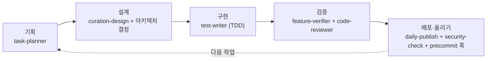

# 나의 AI 협업 워크플로우

비전공자가 AI 에이전트(Claude Code)와 이 프로젝트를 만들면서 실제로 굳어진 작업 방식이다. 상상으로 쓴 게
아니라, 하루하루 하면서 만든 스킬·에이전트·훅이 실제로 어떻게 이어지는지 적었다. 핵심은 하나다. "된다"는
말을 믿지 않고, 매번 확인하고 틀린 걸 인정하고 고쳐 앉는다.

## 하루가 도는 순서

```
계획 → 개발(작게 쪼개서) → 검증 → 올리기
```

1. **계획** — `task-planner` 스킬로 이번 주 목표를 하루 크기 작업으로 쪼개고 완료 기준을 붙인다. GitHub
   이슈로 등록하고 보드(작업중/다음/백로그)로 관리한다. AI가 짜준 계획을 그대로 안 받고, 크기·순서·빠진 걸
   따져서 다듬는다.
2. **개발** — 한 번에 몰아치지 않고 파일 하나·수정 하나·커밋 하나 단위로 쪼갠다. 순수 로직(계산·규칙)을
   새로 만들거나 규칙을 고칠 땐 `test-writer` 스킬로 **테스트를 먼저 쓰고(빨강) 통과시킨다(초록)**.
3. **검증** — 두 겹으로 본다. 기능이 실제로 도는지는 `feature-verifier` 스킬(눈으로 확인, 경계·극단값도),
   코드 자체는 `code-reviewer` 에이전트(정확성 버그·중복·복잡도·테스트 유무·비밀값)로 훑는다.
4. **올리기** — `daily-publish` 스킬로 로컬 브랜치 push + hub 미러 PR + 위키·이슈를 한 번에 맞춘다.
   올리기 직전 `security-check`(그리고 커밋 훅 `precommit-scan.sh`)로 키·개인정보를 막는다.

## 단계별로 입력·확인기준·결과물

각 단계를 "무엇을 넣어 → 어떻게 하고 → 뭘 보면 끝이고 → 뭐가 나오는지"로 못 박아둔 것.

| 단계 | 입력 | 작업 순서 | 확인 기준(이게 되면 끝) | 결과물 |
|---|---|---|---|---|
| 계획 | 이번 주 목표 한 줄 | task-planner로 하루 크기 작업 분해 → GitHub 이슈 등록 → 보드 배치 | 각 작업에 **측정 가능한 완료기준**이 붙어 있다("됐다" 금지) | 이슈 목록 + 보드 |
| 개발 | 이슈 하나 | 파일·수정·커밋 단위로 쪼갬. 순수 로직은 test-writer로 테스트 먼저(빨강→초록) | 테스트 통과, 커밋 하나가 한 가지 일만 함 | 작은 커밋 + 통과하는 테스트 |
| 검증 | 만든 변경 | feature-verifier로 실제 구동(경계·극단값까지) + code-reviewer로 코드 훑기 | 눈으로 도는 걸 확인했고, 리뷰 지적을 반영했다 | 검증된 변경 |
| 올리기 | 검증된 변경 | security-check → 브랜치 push → hub 미러 PR → 위키·이슈 갱신 | 비밀값 0, PR base가 N186_이재호, main 안 건드림 | PR + 네 곳(로컬·hub·위키·이슈) 최신 |

## Agent 협업 시각화 (단계 × 도구 × 사람/AI)

기획부터 배포까지 각 단계에서 어떤 Skill·Agent를 썼고, 무엇을 사람이 정하고 무엇을 AI가 했는지.



| 단계 | 쓴 도구 (Skill / Agent / Hook) | 사람이 결정한 것 | AI가 수행한 것 |
|---|---|---|---|
| 기획 | task-planner (S) | 문제·방향·우선순위, 무엇이 중요한지 | 목표를 하루 크기 작업으로 분해, 완료기준 초안 |
| 설계 | curation-design (S) | 아키텍처(Express 없이 Supabase 직접 조회, 비밀 키는 서버리스 함수에), 화면 방향 | 설계안·컴포넌트 구현 방식 제안 |
| 구현 | test-writer (S) | 방향 승인, 아니라고 판단되면 되돌림 | 코드·테스트 작성(순수 로직은 테스트 먼저) |
| 검증 | feature-verifier (S), code-reviewer (A) | 실제로 돌려 값까지 맞는지 최종 판단 | 실제 구동·극단값 확인, 코드 훑어 버그·비밀값 지적 |
| 배포 | daily-publish·security-check (S), precommit-scan (H) | "올릴지" 결정, 배포 승인 | 커밋 쪼갬·PR·미러·위키 갱신, 키 스캔 |

핵심 구분: **사람은 "무엇을·왜·이게 맞나"를 정하고, AI는 "어떻게"를 실행한다.** AI가 짜준 걸 그대로 받지 않고, 방향은 사람이 잡고 검증하는 층을 하나 더 둔다.

## 도구 목록 (실제로 만든 것)

### 스킬 (.claude/skills)
- **task-planner** — 목표를 하루 크기 작업으로 쪼개고 우선순위·완료기준을 매긴다.
- **test-writer** — 테스트 먼저 쓰기(TDD). 서버(server/)는 `node:test`, 프론트(src/)는 `vitest`.
- **feature-verifier** — "됐다"고 말하기 전에 실제로 돌려서 확인한다. 극단값은 안 깨짐이 아니라 값 정확성까지.
- **curation-design** — 화면 디자인 토큰·컴포넌트 규칙.
- **security-check** — 올리기 전 키·개인정보 검사.
- **daily-publish** — 하루치 산출물을 네 곳(로컬·hub·위키·이슈)에 어긋나지 않게 올린다. PR 본문은 챌린지
  공식 템플릿을 따르고, 자기 이해도 칸은 내가 직접 쓴다(대필 안 함).

### 에이전트 (.claude/agents)
- **code-reviewer** — 올리기 전 변경을 훑어 문제를 짚는다. 자동으로 고치지 않고 무엇을 왜 고칠지만 알려준다.

### 훅 (.claude/hooks)
- **precommit-scan.sh** — git commit 직전 비밀키 패턴을 스캔해 섞이면 커밋을 막는다.

## 이 워크플로우가 실제로 잡은 것

말뿐인 절차가 아니라 진짜로 버그를 걸렀다.

- `test-writer`로 매칭 함수 테스트를 쓰다가, eligibility가 없는 공고에서 화면이 통째로 터지는 버그를 발견해
  고쳤다(테스트가 먼저 잡음).
- `code-reviewer`를 실제 코드에 돌렸더니, 온통청년 재학생 제외 로직이 휴학생을 빠뜨려 잘못 걸러내던 걸
  잡았다. 그 방어를 추가한 뒤 다시 돌렸더니, 이번엔 "필드 하나만 null인 경우"는 여전히 안 막힌다는 것까지
  짚어서 또 고쳤다.
- 정확도 측정용 라벨링을 하다가, 링커리어·위비티·부산청년플랫폼 수집기가 실제 자격요건을 제대로 못 담는다는
  한계를 데이터로 확인해 기록했다.

## 문제가 생기면 이 순서로 확인 (실제로 겪은 것)

증상별로, 상상하지 말고 아래 순서로 좁혀 들어간다.

- **수집 결과가 갑자기 확 줄었다** → 소스를 하나씩 따로 돌려 어디서 깨졌는지 격리한다. (여러 소스를 동시에 돌리다 콘코 연결이 무더기로 끊긴 적 있음 → 순차 실행 + 재시도로 해결. "차단당했다"고 단정 말고 먼저 격리.)
- **배포했는데 기능이 안 된다** → ① 브라우저 Network에서 `/api/recommend` 응답 코드 확인 ② Vercel 환경변수(키)가 등록됐는지 ③ 배포 번들에 비밀 키가 새어나갔는지(grep) ④ 데이터는 최신인지(Supabase 직접 조회라 재배포와 무관).
- **매칭이 이상하다(딴 지역·엉뚱한 게 뜸)** → match.js의 지역은 하드 조건인지, regionLookup의 canonical 지역명 매핑이 맞는지 확인. 규칙 고치면 그 자리에 회귀 테스트를 남긴다.
- **상태·즐겨찾기가 새로고침하면 사라진다** → localStorage 읽기/쓰기 경로, 그리고 **같은 origin(고정 도메인)** 에서 보고 있는지(배포별 URL은 origin이 달라 localStorage가 안 넘어옴).
- **"이제 되겠지" 싶을 때** → 그게 제일 위험한 순간. 멈추고 실제로 돌려서 **값까지** 확인한다. 안 깨졌다가 아니라 결과가 맞는지.

## 지키는 원칙 (몸으로 익힌 것)

- "된다"는 말 금지. 눈으로 확인하거나 테스트를 통과한 것만 됐다고 친다.
- 작게 쪼갠다. 커밋도 작업도. 실수를 일찍 잡고 무엇이 왜 바뀌었는지 보이게.
- 애매하면 잘못 걸러내는 쪽(false negative)보다 통과시키는 쪽으로. 놓치는 게 제일 나쁜 실수다.
- AI가 짜준 걸 그대로 안 받는다. 방향은 내가 잡고, 검증하는 층을 하나 더 둔다.
- main에 안 올린다. 올리기 전 비밀값부터 검사한다.
